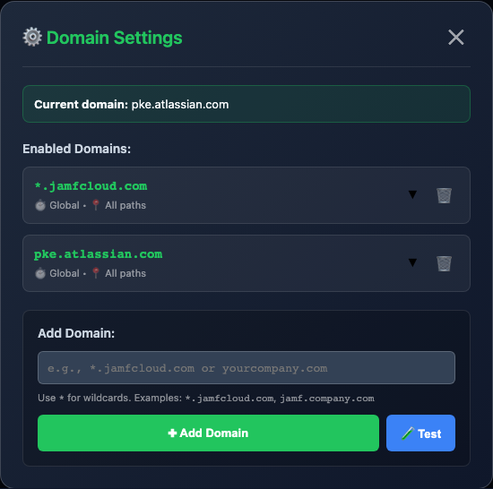

<div align="center">
  
  
  # Browser Auto Refresh
  
  A universal userscript that adds a draggable floating auto-refresh widget to any website, with customizable intervals, smart positioning, and domain-based configuration. Originally designed for Jamf Pro, now works on any site you configure.
</div>

> **📢 Repository Renamed**: This project was formerly known as `jamf-auto-refresh`. GitHub automatically redirects old URLs, so existing installations will continue to work and receive updates.

## Features

- 🖱️ **Draggable Floating Window** - Move the widget anywhere on screen
- 📍 **Position Memory** - Remembers window position across page reloads
- ⏱️ **Session Duration Tracking** - Shows total uptime since first page load
- 🔄 **Manual Refresh Button** - Instantly refresh the page without waiting for the timer
- 🕒 **Last Refresh Timestamp** - Shows when the page was last refreshed (e.g., "30 sec ago")
- 📊 **Session Counter** - Tracks how many times the page has refreshed (persists across reloads)
- ⏱️ **Customizable Intervals** - Choose from 15 seconds to 30 minutes
- 🎯 **Typing Detection** - Delays refresh when actively typing in forms
- 💾 **Persistent Statistics** - All stats (counter, timestamp, session duration) survive page refreshes
- 🔔 **Visual Countdown** - Shows remaining time before next refresh
- 🎨 **Modern Design** - Gradient background with clean, intuitive interface
- 🎯 **Always Accessible** - Floats above page content, never gets hidden

## Installation

1. Install a userscript manager for your browser:
   - **Chrome/Edge**: [Tampermonkey](https://chrome.google.com/webstore/detail/tampermonkey/dhdgffkkebhmkfjojejmpbldmpobfkfo)
   - **Firefox**: [Tampermonkey](https://addons.mozilla.org/en-US/firefox/addon/tampermonkey/) or [Greasemonkey](https://addons.mozilla.org/en-US/firefox/addon/greasemonkey/)
   - **Safari**: [Userscripts](https://apps.apple.com/app/userscripts/id1463298887)

2. Install the script:
   - **Direct Install** (Recommended): [Click here to install](https://raw.githubusercontent.com/BetterCallSaulAtlas/browser-auto-refresh/main/jamf_auto_refresh.js)
   - Or [download from GitHub Releases](https://github.com/BetterCallSaulAtlas/browser-auto-refresh/releases/latest)
   - Or copy the contents of `jamf_auto_refresh.js` and create a new script in your userscript manager

3. **Configure your Jamf Pro domains**:
   - Open the script in your userscript manager's editor
   - Find the `USER CONFIGURATION` section at the top of the script
   - Edit the `ENABLED_DOMAINS` array to include your Jamf Pro instance URLs
   - Example:
     ```javascript
     const ENABLED_DOMAINS = [
       'yourcompany.jamfcloud.com',
       'jamf.yourcompany.com'
     ];
     ```
   - Save the script

4. Navigate to your Jamf Pro instance

5. The floating widget will appear in the bottom-left corner (you can drag it anywhere)

### Automatic Updates
The script automatically checks for updates daily. Your userscript manager will notify you when a new version is available.

To manually check for updates:
- **Tampermonkey**: Click the extension icon → Dashboard → Click the script name → Check for updates
- **Greasemonkey**: Click the extension icon → User Scripts → Click the script → Check for updates

## Configuration

### Visual Domain Manager (Recommended)

The easiest way to configure domains is through the built-in visual interface:

1. **Open the floating widget** on any page
2. **Click "⚙️ Domain Settings"** button
3. **Use the visual interface** to:
   - View all configured domains
   - Add new domain patterns
   - Test patterns before adding
   - Remove unwanted domains
   - See which patterns match the current page

#### Floating Widget


#### Domain Settings Modal


### Features:
- ✅ **Current Domain Indicator** - Shows your current hostname
- ✅ **Domain List** - All configured domains with delete buttons
- ✅ **Color Coding** - Domains matching current page shown in green
- ✅ **Test Button** - Validate patterns before adding
- ✅ **Real-time Feedback** - Success/error messages
- ✅ **Auto-save** - Changes persist immediately

<details>
<summary><strong>💻 Manual Configuration (Advanced)</strong> - Code editing for power users</summary>

You can also edit the configuration directly in the code:

**To configure:**
1. Open your userscript manager (e.g., Tampermonkey)
2. Click on the script to edit it
3. Find the `USER CONFIGURATION` section (near the top)
4. Edit the `DEFAULT_ENABLED_DOMAINS` array

**Examples:**

```javascript
// Single domain
const DEFAULT_ENABLED_DOMAINS = [
  'yourcompany.jamfcloud.com'
];

// Multiple domains
const DEFAULT_ENABLED_DOMAINS = [
  'yourcompany.jamfcloud.com',
  'jamf.yourcompany.com',
  'jamf-prod.internal.company.com'
];

// Using wildcards (matches any subdomain)
const DEFAULT_ENABLED_DOMAINS = [
  '*jamfcloud.com'  // Matches any *.jamfcloud.com domain
];
```

**Note:** The visual domain manager stores settings in localStorage. If you edit the code directly, those changes will be used as defaults for new configurations.

</details>

<details>
<summary><strong>⚙️ Advanced Configuration</strong> - Path patterns, regex, per-domain intervals</summary>

Click the **▼** expand button on any domain to access advanced settings:

#### **Custom Refresh Intervals**
Set different refresh rates for different domains:
- Production: 5 minutes (less aggressive)
- Development: 15 seconds (rapid updates)
- Staging: 1 minute (balanced)

#### **Path-Based Matching**
Enable auto-refresh only on specific pages:

**Include Patterns** (matches these paths):
- `/computers.html` - Exact match
- `/computers*` - Starts with /computers
- `*/devices/*` - Contains /devices/ anywhere
- `**` - All paths (default)
- `regex:^/computers/.*\.html$` - Regex pattern

**Exclude Patterns** (blocks these paths - takes priority):
- `/settings/*` - Don't refresh settings pages
- `/admin/*` - Don't refresh admin pages
- `regex:.*/edit/.*` - Don't refresh any edit pages

#### **Pattern Types**

**Glob Patterns** (simple wildcards):
- `*` - Matches anything except `/`
- `**` - Matches anything including `/`
- `/computers*` - Starts with /computers
- `*/inventory/*.html` - Contains /inventory/ with .html file

**Regex Patterns** (advanced matching):
- Prefix with `regex:` to use regex
- `regex:^/computers/.*\.html$` - Computers pages ending in .html
- `regex:^/(computers|devices)/` - Computers OR devices pages
- `regex:^(?!.*/edit/).*$` - Anything NOT containing /edit/

### Configuration Examples

#### Example 1: Production vs Development
```javascript
[
  {
    domain: 'prod.jamfcloud.com',
    interval: 300000, // 5 minutes
    paths: {
      include: ['/dashboard*', '/computers.html'],
      exclude: ['/settings/*']
    }
  },
  {
    domain: 'dev.jamfcloud.com',
    interval: 15000, // 15 seconds
    paths: {
      include: ['*'],
      exclude: []
    }
  }
]
```

#### Example 2: Only Inventory Pages
```javascript
[
  {
    domain: '*.jamfcloud.com',
    interval: 60000, // 1 minute
    paths: {
      include: ['/computers.html', '/mobileDevices.html', '/inventory/*'],
      exclude: []
    }
  }
]
```

#### Example 3: Complex Regex Patterns
```javascript
[
  {
    domain: 'jamf.company.com',
    interval: null, // Use global
    paths: {
      include: ['regex:^/(computers|devices)/.*\\.html$'],
      exclude: ['regex:.*/edit/.*', 'regex:.*/settings/.*']
    }
  }
]
```

</details>

## Usage

### Basic Controls
- **Drag Window**: Click and hold the header to move the window anywhere on screen
- **Manual Refresh**: Click the 🔄 Refresh Now button to refresh immediately
- **Toggle Auto-refresh**: Click the Enable/Disable button to turn auto-refresh on or off
- **Change Interval**: Use the dropdown to select refresh interval (15s to 30min)

<details>
<summary><strong>📊 Additional Features</strong> - Display information and smart features</summary>

### Display Information
The widget shows:
- **Next refresh**: Countdown to next automatic refresh
- **Refresh count**: Total number of refreshes (persists across page reloads)
- **Last refresh**: Time since last refresh (e.g., "30 sec ago")
- **Session duration**: Total uptime since first page load (e.g., "45m 20s")

### Keyboard Activity Detection
The script automatically delays refresh when you're typing in forms to prevent data loss.

</details>

## Version History

### v2.2.0 (Latest)
- 🏷️ **Rebranding** - Renamed to "Browser Auto Refresh" (universal functionality)
- 📦 **Repository Renamed** - `jamf-auto-refresh` → `browser-auto-refresh`
- 🔗 **Updated URLs** - All script headers point to new repository location
- ✅ **Backward Compatible** - Existing installations continue to work via GitHub redirects
- 📝 **Enhanced Description** - Emphasizes universal usability across any website
- 🔄 **Auto-update** - Users will automatically receive this update

### v2.1.2
- 🐛 **Viewport Constraints Fix** - Widget stays accessible during window resize
- 🎯 **Smart Hybrid Positioning** - Maintains relative position for center widgets, preserves edge positioning
- 🖱️ **Real-time Drag Constraints** - Cannot drag widget off-screen (20px minimum visible)
- ✅ **Auto-correction** - Invalid saved positions fixed on load
- ⚡ **Smooth Performance** - Debounced resize handler (250ms)
- 📐 **Full Visibility** - Entire widget (width + height) always visible

### v2.1.1
- 🐛 **Script Duplication Fix** - Prevents multiple instances during SPA navigation
- 🛡️ **Session-Persistent Flags** - Window-level protection flags prevent re-execution
- 🔄 **History API Protection** - Prevents multiple wrapping of pushState/replaceState
- 🖱️ **Drag Listener Protection** - Prevents accumulating document-level event listeners
- ⚡ **Performance Improvements** - Reduced memory usage and event listener overhead

<details>
<summary><strong>📦 Previous Versions</strong> (click to expand)</summary>

### v2.1.0
- 🎯 **Path-Based URL Matching** - Enable only on specific pages
- 🌐 **Glob Pattern Support** - Use `*`, `**`, `/computers*`, `*/devices/*`
- 🔧 **Regex Pattern Support** - Use `regex:^/computers/.*\.html$` for complex matching
- ⏱️ **Per-Domain Intervals** - Set custom refresh rates for each domain
- 📍 **Include/Exclude Paths** - Fine-grained control over which pages to refresh
- ⚙️ **Full Advanced Settings UI** - Edit intervals and paths visually
- 🎨 **Expandable Config Cards** - Click to reveal advanced settings
- 💾 **Auto-save Configuration** - All changes persist immediately
- 🔄 **Backward Compatible** - Auto-migrates from v2.0.0
- 📊 **Config Display** - Shows interval and path count at a glance

### v2.0.0
- 🎨 **Visual Domain Manager UI** - Manage domains through intuitive modal interface
- ✨ **No Code Editing Required** - Add/remove domains with buttons and inputs
- 🧪 **Pattern Testing** - Test domain patterns before adding them
- 🎯 **Real-time Feedback** - Success/error messages for all operations
- 🔍 **Domain Highlighting** - Current domain shown in green if it matches a pattern
- ⌨️ **Keyboard Support** - Press Enter to add domains quickly
- 💾 **Auto-save** - Changes persist immediately to localStorage
- 🔙 **Backward Compatible** - Still supports DEFAULT_ENABLED_DOMAINS for manual editing

### v1.9.0
- ✨ **User-Configurable Domains** - Easy-to-edit configuration section at top of script
- 🌐 **Universal @match** - Script uses `@match *://*/*` with runtime domain checking
- 🔧 **Domain Whitelist** - Script only runs on domains you specify in ENABLED_DOMAINS array
- 📝 **Wildcard Support** - Use `*jamfcloud.com` to match any subdomain
- 🔒 **Safe by Default** - Won't interfere with other websites outside your whitelist
- 📚 **Better Documentation** - Comprehensive configuration examples in README

### v1.8.0
- 🎨 **Reverted to Floating Window Design** - Draggable floating window instead of sidebar integration
- ✨ **Session Duration Tracking** - Shows total uptime since first page load
- 💾 **Persistent Statistics** - Refresh counter, timestamp, and session duration survive page reloads
- 🖱️ **Drag & Drop** - Click and drag the header to reposition the window
- 📍 **Position Memory** - Window location saved to localStorage
- ✨ **Simplified UI** - All controls visible in one compact window (no dropdown)
- 🎨 **Modern Design** - Gradient background with improved visual hierarchy
- 🎯 **Better Icons** - Added emoji icons for visual feedback (🔄, ⏸, ▶)
- 🔧 **Code Cleanup** - Removed complex sidebar integration logic

### v1.7.1
- 🔧 **Fix URL Matching** - Added wildcard to match all pages, not just root
- ✨ Added support for `atlassian.jamfcloud.com` domain
- 🐛 Fixed issue where script wouldn't load on Jamf instances

### v1.7.0
- 🎯 **Perfect Native Integration** - Widget perfectly mimicked Jamf's native sidebar items
- ✨ Used exact styling from native items (padding: 8px, height: 28px, gap: 12px)
- ✨ Matched native icon styling with proper SVG refresh icon

### v1.6.0
- 🎨 **Major UI Overhaul** - Moved from top navigation to sidebar
- ✨ Added full-width sidebar widget with icon, label, and countdown badge

### v1.5.0
- ✨ Added "Refresh Now" button for manual page refresh
- ✨ Added last refresh timestamp with live updates
- ✨ Added session refresh counter

</details>
